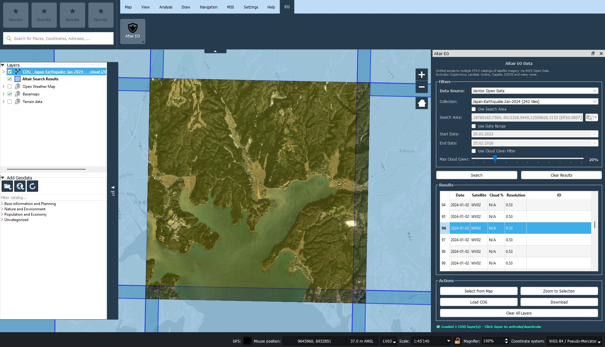
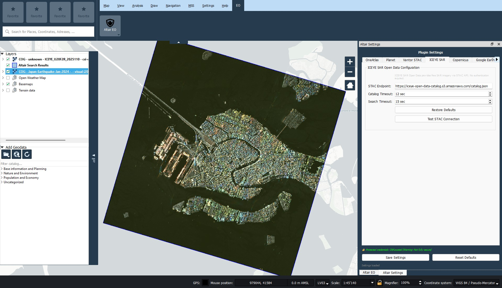

# KADAS Altair - Satellite Imagery Browser Plugin

**Multi-source satellite imagery browser for KADAS Albireo 2**

[](LICENSE)
[](https://github.com/mlanini/kadas-altair)
[](https://github.com)

## 📷 Screenshots

 

 

---

## 📚 Documentation

- **[README.md](README.md)** - Overview, Features, Quick Start (this file)
- **[GUIDE.md](GUIDE.md)** - Complete User Guide: Installation, Configuration, Usage
- **[ARCHITECTURE.md](ARCHITECTURE.md)** - System Architecture, Connectors, Performance, Network Stack
- **[CONTRIBUTING.md](CONTRIBUTING.md)** - Development Guidelines, Testing, Adding Connectors

---

## 🚀 Quick Start

### Installation

Download `kadas_altair_plugin_full.zip` and install via:
- KADAS Albireo → `Plugins` → `Manage and Install Plugins` → `Install from ZIP`

Or copy manually:
```powershell
# Windows (exact path depending on KADAS configuration, e.g. MIL or CIV)
Copy-Item -Recurse kadas_altair_plugin "$env:APPDATA\Kadas\Kadas\profiles\default\python\plugins\"

# Linux/macOS
cp -r kadas_altair_plugin ~/.local/share/Kadas/Kadas/profiles/default/python/plugins/
```

### First Use

1. Open: `Plugins` → `Altair` → `Altair EO Data Panel`
2. Select connector (e.g., "Maxar Open Data")
3. Click **Authenticate** (no credentials needed for open data)
4. Select collection from dropdown
5. Draw search area or use map extent
6. Click **Search** → Results appear in table
7. Select imagery → **Load Layer** → Done!

---

## ✨ Features

### 5 Production-Ready Connectors

| Connector | Type | Collections | Resolution | Coverage |
|-----------|------|-------------|------------|----------|
| **ICEYE SAR** | Radar | 3 (196 items) | 1-3m | Global |
| **Umbra SAR** | Radar | Recursive STAC | 16-25cm | Global |
| **Capella SAR** | Radar | ~1000 images | ~1m | Global |
| **Maxar Open Data** | Optical | 55+ events | 0.3-0.5m | Disasters |
| **Copernicus** | Multi | Sentinel 1/2/3/5P | 10m-7km | Global |

**Total: 300+ collections**

### Key Capabilities

- ✅ **Multi-Source** - 5 ready-to-use connectors (3 SAR + 1 Optical + 1 Multi-sensor)
- ✅ **"All Sources" Aggregation** - Search across all connectors simultaneously
- ✅ **Fast Performance** - Parallel loading (5x speedup) + 5-minute caching
- ✅ **No API Keys** - All open data sources work without credentials
- ✅ **OAuth2 Support** - Copernicus Dataspace authentication
- ✅ **STAC Compliant** - Standard catalog API integration
- ✅ **Interactive Search** - Bbox, date range, cloud cover filters
- ✅ **COG Loading** - Cloud-Optimized GeoTIFF via GDAL vsicurl
- ✅ **Proxy Support** - QgsNetworkAccessManager for SSL/proxy handling
- ✅ **Logging System** - Comprehensive debug and error tracking

### Data Sources

**SAR (Synthetic Aperture Radar):**
- **ICEYE** - 196 open data scenes, all-weather acquisition
- **Umbra** - Up to 16cm resolution, GEC/SICD/SIDD/CPHD products
- **Capella** - X-band radar, multiple organization types

**Optical:**
- **Maxar** - Sub-meter resolution for emergency response

**Multi-Sensor:**
- **Copernicus** - Sentinel constellation (optical + SAR + atmospheric)

---

## 🏗️ Architecture

```
kadas_altair_plugin/
├── connectors/          # Data source implementations
│   ├── copernicus.py    # Copernicus Dataspace (OAuth2)
│   ├── iceye_stac.py    # ICEYE SAR Open Data
│   ├── umbra_stac.py    # Umbra SAR Open Data
│   ├── capella_stac.py  # Capella SAR Open Data
│   ├── vantor_stac.py   # Maxar/Vantor STAC
│   ├── oneatlas.py      # OneAtlas (stub)
│   └── planet.py        # Planet (stub)
├── gui/                 # User interface
│   ├── dock.py          # Main panel
│   └── settings_dock.py # Settings
├── utilities/           # Helpers
│   └── proxy_handler.py # Network configuration
└── secrets/             # Credential management
    └── secure_storage.py
```

### Network Stack

All connectors use **QgsNetworkAccessManager** for:
- SSL/TLS without Python ssl module dependency
- Automatic KADAS proxy configuration (inherited from QGIS base)
- Consistent error handling
- Certificate management via Qt

See [ARCHITECTURE.md](ARCHITECTURE.md) for complete technical details on networking, proxy/VPN handling, and OpenSSL configuration.

---

## � Building

### Full Package (with dependencies)
```powershell
python package_plugin_full.py
# Creates: kadas_altair_plugin_full.zip (~1.8 MB)
```

### Lite Package (no dependencies)
```powershell
python package_plugin_lite.py  
# Creates: kadas_altair_plugin_lite.zip (~200 KB)
```

---

## 🤝 Contributing

See [CONTRIBUTING.md](CONTRIBUTING.md) for development guidelines.

## 📄 License

GPL-2.0 License - See [LICENSE](LICENSE) for details.

This plugin integrates with:
- Maxar Open Data (CC BY-NC-SA 4.0)
- ICEYE Open Data (various licenses)
- Copernicus Sentinel Data (open access)

---

## 🔗 Resources

- **Repository**: https://github.com/mlanini/kadas-altair
- **Issues**: https://github.com/mlanini/kadas-altair/issues
- **KADAS**: https://www.kadas.org/
- **STAC Spec**: https://stacspec.org/

---

**Author**: Michael Lanini  
**Email**: mlanini@proton.me  
**Version**: 0.2.0
- 📦 **COG Loading** - Cloud-Optimized GeoTIFF via GDAL vsicurl (no download)

### Technical Capabilities
- 🌐 **Proxy Support** - Inherits QGIS network settings (auto-configured)
- 🔒 **SSL Handling** - Uses QGIS SSL certificates
- 📝 **Logging** - Detailed logs with built-in viewer
- 🔧 **Minimal Dependencies** - Only pystac-client (bundled in full package)
- ⚡ **Error Handling** - Graceful degradation, user-friendly messages
- 🧩 **Zero Dependencies** - Uses only QGIS built-in libraries

The plugin **automatically inherits** KADAS network settings:

- **Proxy**: Configure in KADAS → `Settings` → `Options` → `Network`
- **SSL**: Uses KADAS SSL certificate manager (QGIS-based)
- **Timeouts**: Default settings work for most cases

**Common setups work out-of-the-box**:
- ✅ Direct internet (default)
- ✅ Corporate proxy (configure in KADAS settings)
- ✅ VPN connections (automatic)

---

## 🌐 Data Sources Details

### ICEYE SAR Open Data
- **Type**: Synthetic Aperture Radar (SAR)
- **Collections**: 3 (196 total items)
- **Resolution**: Various (spotlight, stripmap modes)
- **Coverage**: Global sample areas
- **Features**: All-weather, day/night acquisition, cloud-independent
- **Use Cases**: Change detection, infrastructure monitoring, disaster response

### Maxar Open Data (Vantor STAC)
- **Type**: High-resolution optical imagery
- **Collections**: 55 disaster/emergency events
- **Resolution**: Sub-meter (0.3-0.5m)
- **Coverage**: Disaster response areas worldwide
- **Features**: Recent events, very high resolution
- **Use Cases**: Emergency response, damage assessment, humanitarian aid

### swisstopo RapidMapping
- **Type**: Emergency mapping products
- **Collections**: BLATTEN + other Swiss events (3+)
- **Coverage**: Switzerland
- **Features**: Rapid disaster response, localized
- **Use Cases**: Swiss emergency planning, disaster coordination

---

## 🎯 Core Capabilities

- **Search**: Spatial (bbox/polygon), temporal (date range), attribute filters
- **Selection**: Interactive map + table with bidirectional sync
- **Loading**: Preview (thumbnails) + Full COG (streaming, no download)
- **Network**: Auto proxy/SSL via QGIS settings, no configuration needed

*Full feature list in [GUIDE.md](GUIDE.md)*

---

## 📦 Project Structure

```
kadas-altair/
├── README.md                      # This file (overview)
├── GUIDE.md                       # User guide
├── ARCHITECTURE.md                # System architecture & technical reference
├── CONTRIBUTING.md                # Development guidelines
├── LICENSE                        # GPL v2+ License
├── package_plugin_full.py         # Build script (full)
├── package_plugin_lite.py         # Build script (lite)
└── kadas_altair_plugin/          # Plugin source
    ├── connectors/                # Data source implementations
    │   ├── iceye_stac.py         # ICEYE SAR
    │   ├── umbra_stac.py         # Umbra SAR
    │   ├── capella_stac.py       # Capella SAR
    │   ├── vantor.py             # Maxar Open Data
    │   ├── copernicus.py         # Copernicus Dataspace
    │   └── connector_manager.py  # Registry
    ├── gui/                       # User interface
    │   ├── dock.py               # Main panel
    │   └── settings_dock.py      # Settings
    ├── utilities/                 # Helpers
    │   └── proxy_handler.py
    ├── secrets/                   # Credential management
    └── test/                      # Test scripts
```

*See [CONTRIBUTING.md](CONTRIBUTING.md) for development structure and adding connectors*

---

## 🔧 Requirements

- **Software**: KADAS Albireo 2.3+ (based on QGIS 3.x)
- **Network**: Internet connection
- **Dependencies**: None (uses KADAS built-in libraries)

✅ Tested on KADAS Albireo 2.3+, Windows/Linux/macOS

---

## 🎓 Next Steps

**New Users:**  
→ Follow Quick Start above (5 min)  
→ Read [GUIDE.md](GUIDE.md) tutorial (15 min)

**Advanced Users:**  
→ Configure custom settings in plugin  
→ See [GUIDE.md](GUIDE.md) for troubleshooting

**Developers:**  
→ Read [CONTRIBUTING.md](CONTRIBUTING.md) for development setup  
→ Check [ARCHITECTURE.md](ARCHITECTURE.md) for system architecture and connectors  
→ See `connectors/base.py` for extensibility

---

## 🐛 Common Issues

| Issue | Solution |
|-------|----------|
| Plugin not appearing | Verify folder name `kadas_altair_plugin`, restart KADAS |
| Collections not loading | Select connector from dropdown, wait for auto-population |
| No search results | Expand date range, increase cloud cover, verify area |
| **Proxy/VPN errors** | **See [ARCHITECTURE.md](ARCHITECTURE.md#proxy--vpn-handling) - Auto-configured from KADAS settings** |
| COG loading fails | Check internet connection, verify GDAL vsicurl support |
| **OpenSSL 3.0 legacy provider error** | **See [ARCHITECTURE.md](ARCHITECTURE.md#openssl-configuration) - Auto-configured by plugin** |

*Full troubleshooting in [GUIDE.md](GUIDE.md)*

---

## 📊 Status

| Component | Status | Details |
|-----------|--------|---------|
| **ICEYE SAR** | ✅ Production | 3 collections, 196 items |
| **Maxar Open Data** | ✅ Production | 55 disaster events |
| **swisstopo** | ✅ Production | 3+ emergency events |
| **GUI** | ✅ Complete | Interactive footprints, settings |
| **Documentation** | ✅ Complete | README, GUIDE, ARCHITECTURE |
| **Tests** | ✅ Available | Connector validation suite |

---

## 🤝 Contributing

Contributions welcome! See [CONTRIBUTING.md](CONTRIBUTING.md) for development guidelines and [ARCHITECTURE.md](ARCHITECTURE.md) for technical details.

**Areas for contribution**:
- Additional STAC connectors
- UI/UX improvements
- Documentation enhancements
- Bug fixes and optimizations

**Before submitting issues**:
- Check logs: `Plugins` → `Altair` → `📋 View Log`
- Include KADAS version, plugin version (0.2.0)
- Provide steps to reproduce with error messages

**Development Setup**: See [CONTRIBUTING.md](CONTRIBUTING.md) for development guidelines and [ARCHITECTURE.md](ARCHITECTURE.md) for technical architecture.

---

## � License

**GNU General Public License v2 or later**

This program is free software; you can redistribute it and/or modify it under the terms of the GNU General Public License as published by the Free Software Foundation; either version 2 of the License, or (at your option) any later version.

---

## 🙏 Credits

**Author**: Michael Lanini

**Built With**:
- KADAS Albireo 2 API (QGIS-based)
- STAC Specification
- GDAL vsicurl for COG streaming

**Inspired By**:
- [kadas-vantor-plugin](https://github.com/mlanini/kadas-vantor-plugin) - Footprint interaction patterns
- [qgis-maxar-plugin](https://github.com/opengeos/qgis-maxar-plugin) - STAC integration concepts

**Data Sources**:
- ICEYE SAR Open Data
- Maxar Open Data Program
- swisstopo RapidMapping

---

## 📖 Version History

### Version 0.2.0 (January 2026) - Production Release

**Production-Ready Connectors**:
- ✅ ICEYE SAR Open Data (3 collections, 196 items)
- ✅ Maxar Open Data via Vantor STAC (55 events)
- ✅ swisstopo RapidMapping (3+ Swiss events)

**Features**:
- Interactive footprint selection (map ↔ table sync)
- COG loading via GDAL vsicurl (streaming)
- Comprehensive logging with built-in viewer
- Zero external dependencies
- Auto-inherits KADAS network settings

**Documentation**:
- Complete user guide (GUIDE.md)
- System architecture (ARCHITECTURE.md)
- Consolidated to 4 essential files

---

**📖 Full Documentation**: [GUIDE.md](GUIDE.md) • [ARCHITECTURE.md](ARCHITECTURE.md) • [CONTRIBUTING.md](CONTRIBUTING.md)  
**🆘 Support**: Built-in Help (`Plugins` → `Altair` → `Help`) • Log Viewer  
**🐛 Issues**: https://github.com/mlanini/kadas-altair-plugin/issues

**© 2026 Michael Lanini** - Open Source Software
