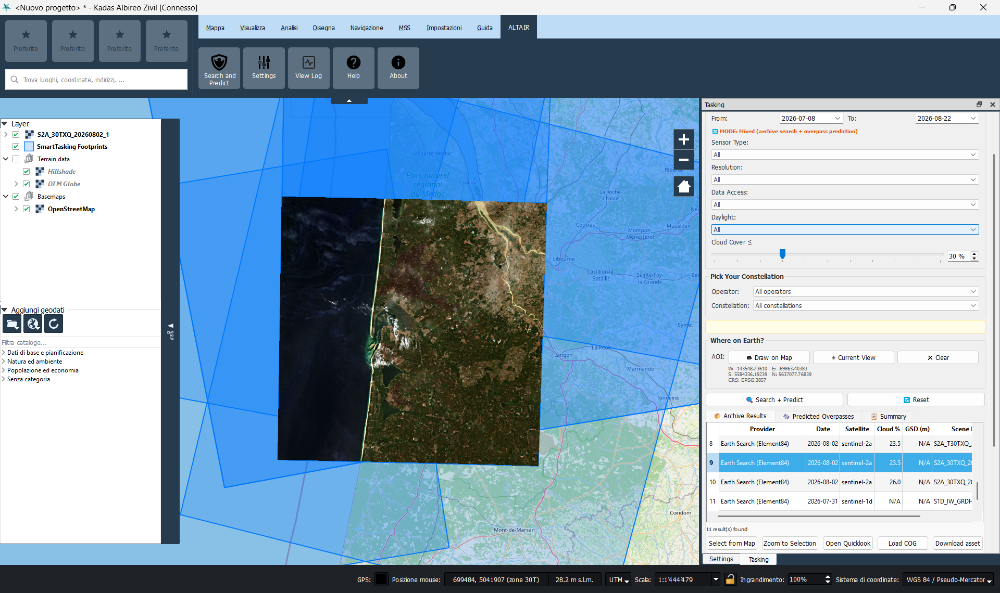
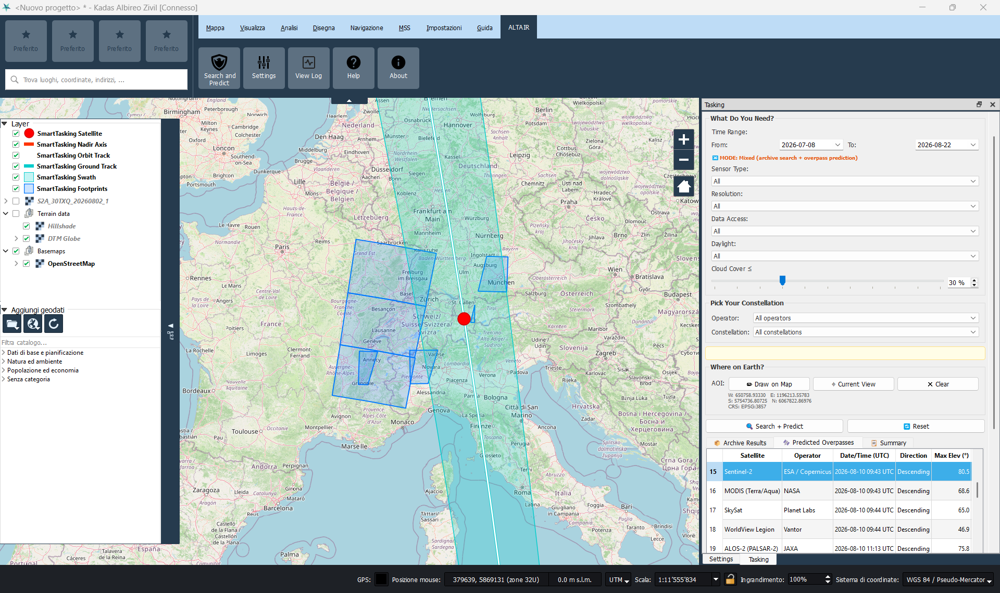

# KADAS Altaír — Satellite Imagery Browser Plugin

**Multi-source satellite imagery browser for KADAS Albireo 2**

[](LICENSE)
[](https://github.com/mlanini/kadas-altair-plugin)
[](https://github.com/mlanini/kadas-altair-plugin)
[](https://deepwiki.com/mlanini/kadas-altair-plugin)

## Screenshots




---

## Documentation

| Document | Contents |
|----------|----------|
| **[README.md](README.md)** | Overview, features, quick start (this file) |
| **[GUIDE.md](GUIDE.md)** | Installation, configuration, usage tutorial |
| **[CHANGELOG.md](CHANGELOG.md)** | Version-by-version change log |

---

## Quick Start

### Installation

Download [kadas_altair_plugin_full_vX.Y.Z.zip](releases/download/v0.5.1/kadas_altair_plugin_full_v0.5.1.zip) and copy manually:

```powershell
# Windows
# Check you KADAS flavour first: Mil, Zivil or Light
Copy-Item -Recurse kadas_altair_plugin "$env:APPDATA\Kadas\KadasZivil\profiles\default\python\plugins\"

# Linux / macOS
cp -r kadas_altair_plugin ~/.local/share/Kadas/KadasZivil/profiles/default/python/plugins/
```

### First Use

1. Activate **KADAS Albireo** → `Settings` → `Plugins Manager` → `KADAS Altair v0.5.1` 
2. Go to "EO" menu tab
3. Choose **Altair Open Data Panel** from Altair menu button
4. Select a connector (e.g. *Vantor Open Data*)
5. Pick a collection from the dropdown
6. Draw a search area or use the map extent
7. Click **Search** — results appear in the table
8. Select a scene → **Load COG** → done

---

## Features

### Connectors

6 production-ready connectors, 1 experimental, 2 stubs:

| # | Connector | Type | Highlights | Status |
|---|-----------|------|------------|--------|
| 1 | **ICEYE SAR** | Radar | 3 collections · 196 items · 1–3 m | Production |
| 2 | **Umbra SAR** | Radar | Recursive STAC · 16–25 cm · GEC/SICD/SIDD/CPHD | Production |
| 3 | **Capella SAR** | Radar | ~1 000 images · X-band · ~1 m | Production |
| 4 | **Vantor Open Data** | Optical | 55+ disaster events · 0.3–0.5 m (Vantor STAC) | Production |
| 5 | **swisstopo STAC** | Optical | SWISSEO S2-SR + Special flights collections | Production |
| 6 | **Copernicus Data Space** | Multi | Sentinel-1/2/3/5P · OAuth2 · 10 m–7 km | Production |
| 7 | **NASA EarthData** | Multi | CMR granule search · STAC catalog | Experimental |
| 8 | **Planet** | Optical | PSScene, SkySatScene · 0.5–3 m | Stub |
| 9 | **OneAtlas** | Optical | Airbus imagery · 0.5 m | Stub |

### Search & Visualization

- **Unified search** — spatial (bbox / polygon), temporal, cloud-cover filters
- **"All Sources" mode** — query every connector in parallel (ThreadPoolExecutor, 5 workers)
- **Interactive footprints** — bidirectional map ↔ table selection with click-on-canvas
- **Quicklook preview** — georeferenced thumbnail overlay (WGS 84)
- **COG loading** — Cloud-Optimized GeoTIFF streaming via GDAL vsicurl (no download)
- **5-minute cache** — collection metadata cached for fast repeated queries

### Smart Tasking

- **Satellite catalogue** — 22 EO satellites with TLE, sensor model, off-nadir limits
- **Overpass prediction** — SGP4 bearing-convergence algorithm (sensor footprint × AOI)
- **3D orbit visualisation** — orbit track, ground track, swath corridor, satellite marker, nadir axis
- **Archive search** — per-satellite historical scene lookup across all STAC connectors
- **Send to Tasking** — one-click prefill of Tasking Order form (provider, sensor, GSD, AOI, dates, SAR mode, notes)

### Tasking Orders

- **Guided form** — provider, sensor, priority, AOI, resolution, cloud cover, SAR parameters
- **Mailto workflow** — generates pre-filled email to the selected provider
- **Smart prefill** — auto-populates from Smart Tasking archive or overpass results

### Network & Security

- **QgsNetworkAccessManager** — inherits KADAS proxy, SSL, and timeout settings automatically
- **OAuth2** — secure token-based authentication for Copernicus Data Space
- **No API keys** — most open-data sources work without credentials
- **OpenSSL 3.0** — legacy provider auto-configured by the plugin

### Logging

- Built-in log viewer (`Plugins` → `Altair` → `View Log`)
- Per-connector debug and error tracking

---

## Building

```powershell
# Full package (bundles pip dependencies)
python package_plugin_full.py
# → kadas_altair_plugin_full_vX.Y.Z.zip

# Skip pip install (CI / offline)
$env:KADAS_SKIP_PIP = "1"; python package_plugin_full.py

```

---

## Requirements

- **KADAS Albireo 2.3+** (QGIS 3.x based)
- Internet connection
- Full package bundles required Python dependencies; lightweight installs only need separate OAuth libraries for CDSE Sentinel

---

## Common Issues

| Issue | Solution |
|-------|----------|
| Plugin not appearing | Verify folder name is `kadas_altair_plugin`; restart KADAS |
| Collections not loading | Select connector, wait for auto-population |
| No search results | Expand date range / cloud cover; verify AOI on map |
| Proxy / VPN errors | Auto-configured from KADAS settings — see [GUIDE.md](GUIDE.md) |
| COG loading fails | Check internet; verify GDAL vsicurl support |
| OpenSSL 3.0 legacy error | Auto-configured by plugin — see [GUIDE.md](GUIDE.md) |

Full troubleshooting: [GUIDE.md](GUIDE.md)

---

## Contributing

Contributions welcome via pull request and issue discussion on GitHub.

**Before submitting issues:**
- Check logs: `Plugins` → `Altair` → `View Log`
- Include KADAS version, plugin version (`0.5.1`), and steps to reproduce

---

## License

**MIT License** — see [LICENSE](LICENSE).

---

## Credits

**Author:** Michael Lanini — mlanini@proton.me

**Built with:**
[KADAS Albireo 2](https://www.kadas.org/) · [STAC Specification](https://stacspec.org/) · [GDAL vsicurl](https://gdal.org/user/virtual_file_systems.html) · [SGP4](https://pypi.org/project/sgp4/)

**Inspired by:**
[eo-predictor](https://github.com/developmentseed/eo-predictor) · [sat-predict](https://sat-predict.davidhsu.cc/) · [kadas-vantor-plugin](https://github.com/mlanini/kadas-vantor-plugin) · [qgis-maxar-plugin](https://github.com/opengeos/qgis-maxar-plugin)

## Imagery Data Licenses And Attributions

The plugin code is MIT licensed, but imagery and metadata are licensed by each
provider. Always follow the provider contract, dataset EULA, and distribution
terms.

| Provider | Data Licensing Model | Attribution Guidance |
|---|---|---|
| ICEYE | Commercial license / contract terms | Include acquisition ID, provider name, and contractual copyright notice required by ICEYE |
| Umbra | Commercial license / contract terms | Include Umbra as source and any contract-specific usage/copyright notice |
| Capella Space | Commercial license / contract terms | Include Capella Space source credit and contractual notice |
| Planet | Commercial license / Planet account terms | Include Planet Labs attribution and order/scene identifiers as required by contract |
| Vantor / Maxar Discovery + Tasking | Commercial license / contract terms | Include Maxar or Vantor source credit and contractual notice |
| Vantor Open Data events | Open-data program terms (check event/dataset page) | Attribute Maxar Open Data / Vantor Open Data and preserve any dataset-specific notice |
| Jilin-1 Gaofen | Tenant/provider-specific terms | Use attribution text from your Jilin API/data agreement |
| JAXA Earth | Public datasets with JAXA terms of use | Credit JAXA Earth / dataset name and comply with dataset terms |
| CDSE Sentinel | Copernicus free and open data policy | Credit European Union, Copernicus Sentinel data, and product generation chain when required |
| swisstopo RapidMapping | Swiss open government/public sector data terms | Credit swisstopo and dataset/event identifier |
| NASA EarthData | Dataset-specific NASA/DAAC terms | Credit NASA + DAAC + collection identifier (for example concept ID/short name) |

Recommended operational rule:
- Store a project-level attribution note with provider, dataset/collection ID,
  acquisition date, and scene/order ID for every published map or export.

---

**[GUIDE.md](GUIDE.md)** · **[CHANGELOG.md](CHANGELOG.md)**
Issues: https://github.com/mlanini/kadas-altair-plugin/issues

© 2026 Michael Lanini — Open Source Software
